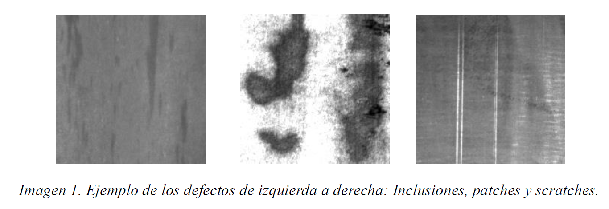
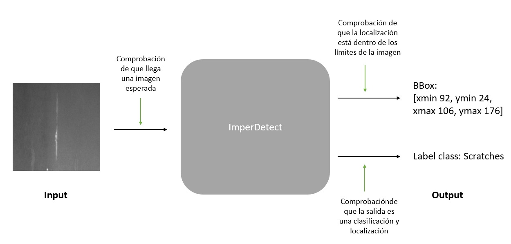
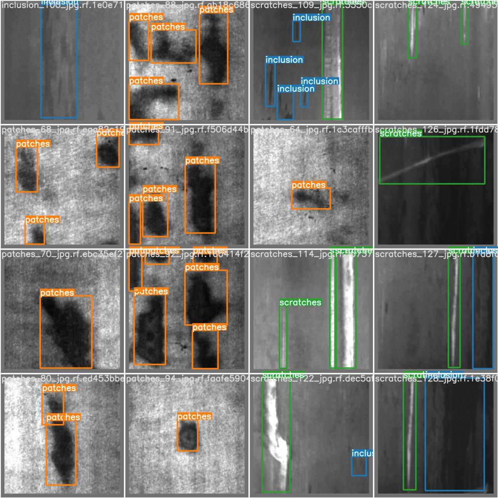

# AIVA_2022_METAL_GRUPO_C
# Clasificación y localización de defectos en imágenes de superficies de metal.


## AUTORES

* **PÉREZ GARCÍA DE LA PUENTE, NATALIA LOURDES** - *Miembro 1* - [Natalia](https://github.com/natalialperez)
* **GILABERT MAÑO, VICENTE** - *Miembro 2* - [Vicent](https://github.com/vgilabert94)
* **ROSARIO TREMOULET, LUIS** - *Miembro 3* - [Luis](https://github.com/Luisrosario2604)


## DESCRIPCION
Este repositorio contiene la práctica para la asignatura Aplicaciones Industriales en la Visión Artificial perteneciente al Máster Universitario en Visión Artificial impartido en la Universidad Rey Juan Carlos.  

El objetivo de este trabajo es la clasificación y detección de defectos en superficies metálicas en una línea de producción. Para ello realizaremos una implementación en *Python* con un detector de objetos (YOLOv5) y lo conectaremos mediante *C* a la aplicación que ya está funcionando en la fábrica.


## DATASET
El dataset proporcionado por la empresa esta compuesto por imágenes de 200x200 en escala de grises.
Por cada categoría nos han proporcionado 300 imágenes con sus etiquetas. Las categorías a clasificar son las siguientes:
* *Inclusions*
* *Patches*
* *Scratches*

<p align="center">
	
</p>


## ESQUEMA GENERAL
<p align="center">
	
</p>


## DOCUMENTACION

Se adjunta la lista de la documentación oficial del proyecto entregada al cliente:
* Entrega 1: -> [Especificación de Requisitos Software (ERS)](docs/ERS_grupoC.pdf)


## REQUISITOS

* Python 3.7+
* Requirements = Requirement.txt
```bash
$ pip install -r requirements.txt
```
###### matplotlib (3.3.4)
###### numpy (1.21.3)
###### opencv_python (4.5.3.56)
###### Pillow (8.4.0)


## EJECUTAR LA APLICACION

* main.py: El archivo principal de la aplicación es el main.py, con el que podemos realizar las primeras pruebas de la clasificación y localización de defectos. 
```bash
$ python main.py
```

* test.py: Es el archivo que realiza los test unitarios sobre el código principal (main.py) para verificar que las funciones/clases funcionen correctamente 
```bash
$ python tests.py -v
```


## RESULTADOS 
<p align="center">
	
</p>
