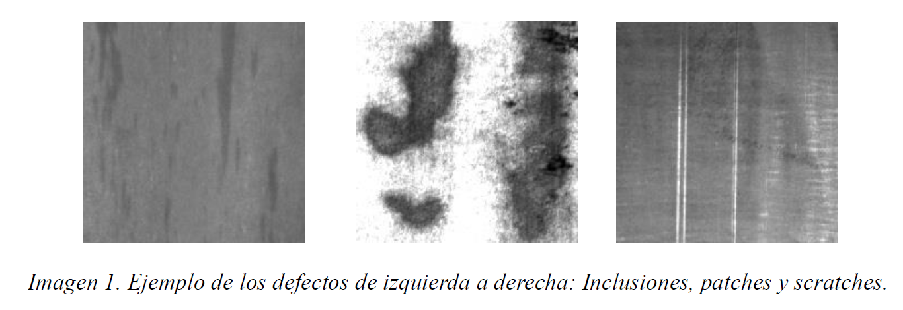
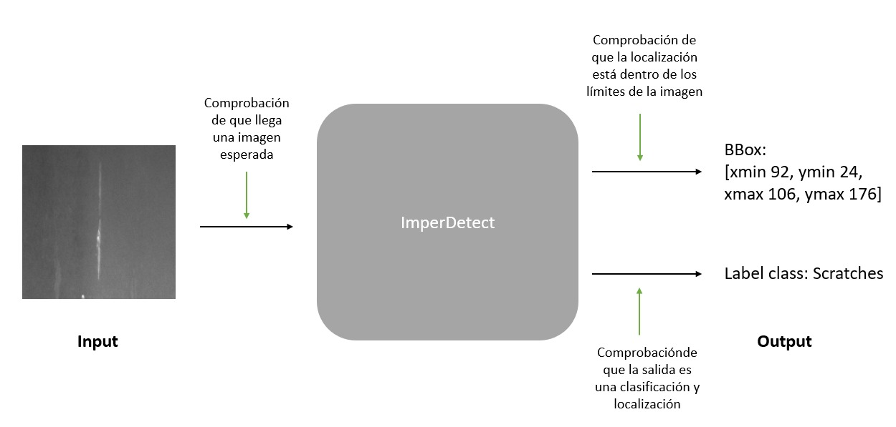
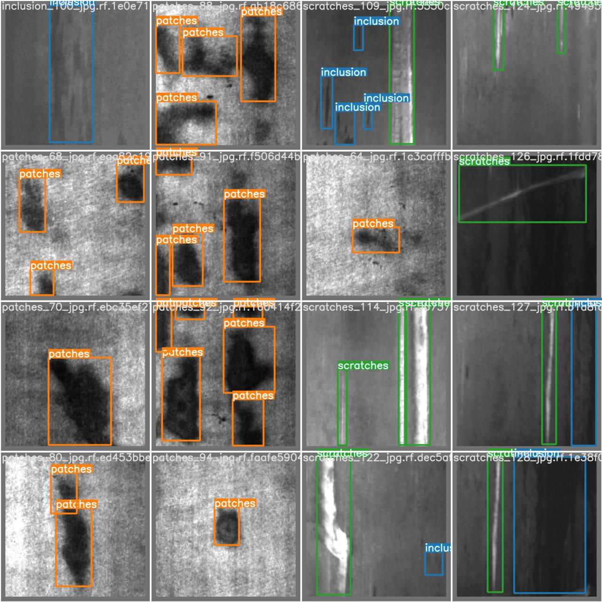

# Classification and localisation of defects in images of metal surfaces.
## This project uses (re-training) of YOLOV5.

#### 👨‍🎓 This project was carried out during my master's degree in computer vision at URJC - Madrid 

###### AIVA_2022_METAL

## Description
This repository contains the practice for the subject Industrial Applications in Machine Vision belonging to the Master's Degree in Machine Vision taught at the Universidad Rey Juan Carlos.

The aim of this work is the classification and detection of defects on metal surfaces in a production line. To do so, we will make an implementation in *Python* with an object detector (YOLOv5) and we will connect it via *C* to the application that is already running in the factory.

## Dataset
The dataset provided by the company is composed of 200x200 grayscale images.
For each category we have been provided with 300 images with their labels. The categories to be classified are the following:
* *Inclusions*
* *Patches*
* *Scratches*

<p align="center">
	
</p>


## General outline
<p align="center">
	
</p>


## Documentation
The list of official project documentation delivered to the client is attached:
(The documents are in spanish)
* ERS : -> [Especificación de Requisitos Software (ERS)](docs/ERS_grupoC.pdf)
* Design : -> [Documento de diseño](docs/Diseño_grupoC.pdf)
* Functional System : -> [Documento del Sistema funcional](docs/SistemaFuncional_grupoC.pdf)


## Requirements
* Docker
* Postman (http requests)


## How to run the app
Using our docker image, we can install our entire repository and the dependencies we will need. 
```bash
$ docker pull luisrosario04/aiva_2022_metal
```

Once the image is downloaded, we are going to launch the container (docker) with the following command:
```bash
$ docker run -p 8000:5000 luisrosario04/aiva_2022_metal
```
The server listens in *localhost:8000*

Documentation of http requests -> [POSTMAN](https://documenter.getpostman.com/view/4800670/UyrAGHub)


## Tests


When a push or pull is performed automatically:

* When tests are launched the results can be found in the github actions.
* The quality of the code is tested with *flake8* and *mypy*.

There are 20 tests with a total, for a coverage of 96%.


## Project structure
```
    .
    ├── dataset
    │        ├── ANNOTATIONS
    │        └── IMAGES
    ├── docs
    │        ├── Diseño_grupoC.pdf
    │        └── ERS_grupoC.pdf
    ├── docker
    │        └── Dockerfile
    ├── exemples
    │        ├── esquema.jpeg
    │        ├── resultado.jpeg
    │        ├── Screen1.png
    │        └── tipos_defectos.png
    ├── pyproject.toml
    ├── README.md
    ├── requirements_dev.txt
    ├── requirements.txt
    ├── setup.cfg
    ├── setup.py
    ├── src
    │   └── algorithm
    │       └── main_algorithm.py
    │   └── fast_rcnn
    │       └── main_fast_rcnn.py
    │   └── imperfection
    │       └── main_imperfection.py
    │   └── server
    │       └── main_server.py
    │   └── system_recognition
    │       └── main_system_recognition.py
    │   └── yolo_v5
    │       └── main_yolo_v5.py
    ├── tests
    │       └── test_algorithm.py
    ├── yolo_v5
    │       ├── models
    │       ├── utils
    │       ├── weights
    │       ├── detect.py
    │       └── export.py
    └── tox.ini
```

## Results
<p align="center">
	
</p>

## AUTORS
* **PÉREZ GARCÍA DE LA PUENTE, NATALIA LOURDES** - *Member 1* - [Natalia](https://github.com/natalialperez)
* **GILABERT MAÑO, VICENTE** - *Member 2* - [Vicent](https://github.com/vgilabert94)
* **ROSARIO TREMOULET, LUIS** - *Member 3* - [Luis](https://github.com/Luisrosario2604)
